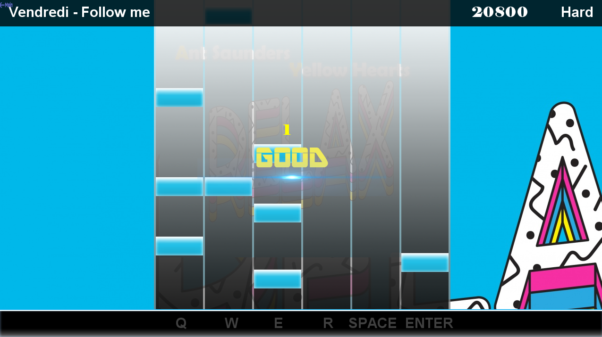

 

 <strong>This is open source rhythm game using Java.</strong>

## Getting Started
### Building and installing

#### Prereqs:
- [JLayer](https://jar-download.com/artifacts/javazoom) to enable support for playing game music
- A java compiler (Java 15.0.1+)

 After downloading and extracting a source, Clone the repository.

    
    git clone https://github.com/cshim31/Visual-Sound.git
  

 Build the visual sound. 
 

    mkdir build && cd build
    cmake ..
    cmake --build . [--config Release]

## Features
- Flexible screen switching
- Beat combo and score feature
- Optimized beat tapping judgement
- Refine game screen and components

